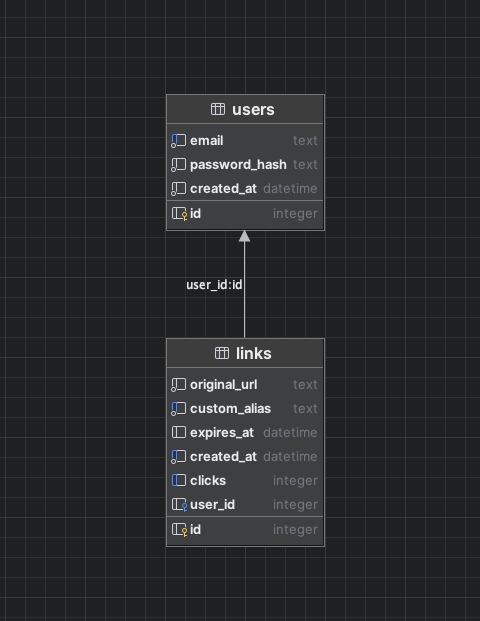
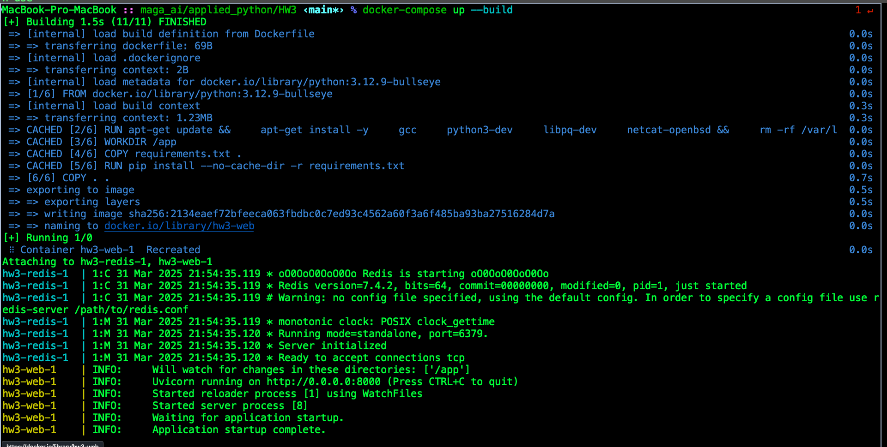
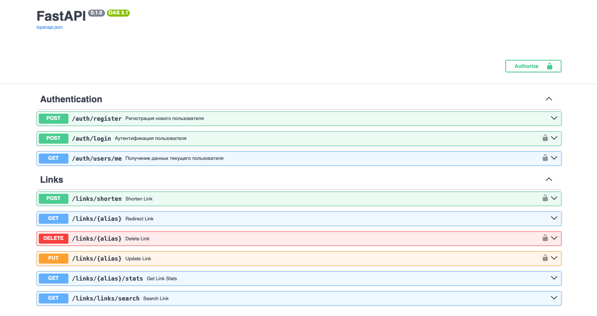

# FastAPI-Сервис для создания сокращенных ссылок

## Схема базы данных (SQLite)

## Описание API
Весь исходный код - в директории src

- db_sqlite - соединение с базой данных 
- redis_ - соединение с redis
- security - необходимые функции для создания, проверки паролей, а также для получения текущего юзера
- routers 
    - auth - все необходимые эндпоинты для аутентификации пользователя (login, register)
    - links - эндпоинты для работы со ссылками
      - POST /shorten - получение сокращенной ссылки (возможна передача пользовательского алиаса, 
      а также даты и времени истечения срока годности ссылки)
      - GET /{alias} - переадресация с короткой ссылки на оригинальную
      - DELETE /{alias} - удаление короткой ссылки (доступно только пользователю, 
      создавшему короткую ссылку)
      - PUT /{alias} - Обновляет оригинальный URL для данного короткого адреса
      - GET /{alias}/stats - статистика по использованию ссылки
      - GET /links/search - поиск короткой ссылки по оригинальному URL

## Запущенный сервис (локально в docker) 

